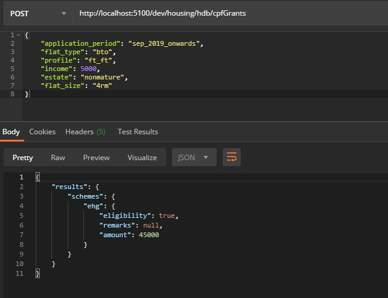
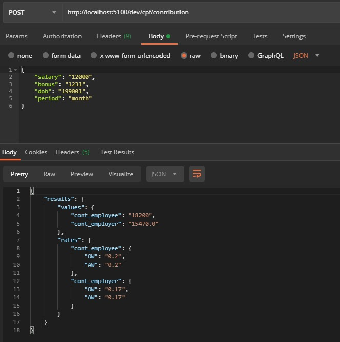
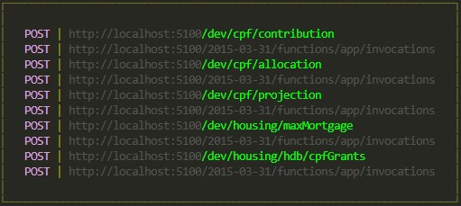
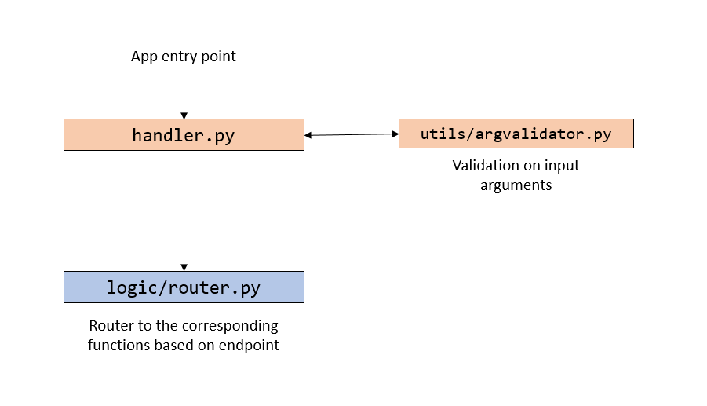

# SG Calculator API

An API that performs the calculation for frequently asked questions in the CPF/HDB domain.

This is written in **Python** and hosted on AWS Lambda via the **Serverless framework**.

## Examples

Find applicable CPF housing grants, given the applicant profile and flat application details:



Find details of CPF monthly contributions:



## Setting up

First, ensure that you have the Serverless framework installed.

Install the `serverless-offline` plugin as well, which allows us to emulate a local environment of Lambda with API Gateway.

```
$ npm install -g serverless
$ npm install --save-dev serverless-offline 
```

Navigate to the root folder and run `serverless offline` or `sls offline`.

This spins up a HTTP server at `http://localhost:5100/dev` and displays a list of endpoints that the server is listening on. The serverless configuration is defined in `serverless.yml`.



### Adding a new module/endpoint

The logic for your new endpoint should be added in the `logic` folder in an appropriate sub-folder.

Then, the following steps would be undertaken to connect the logic to a new API endpoint.

- In `utils/endpoints.py`,
    - Add the path of your new endpoint
- In `utils/strings.py`,
    - Add the required parameters for your new endpoint
- In `utils/argvalidator.py`,
    - Add a new if-else condition in the `run()` function that extracts and formats the list of parameters for your new endpoint
- In `logic/router.py`,
    - Add a new if-else condition in the `execute()` function that calls your corresponding function in the `/logic` directory tree
- In `serverless.yml`,
    - Add the following line as an additional entry under `app.events`, where *{endpoint}* is the path of your new endpoint
    - This new endpoint will be added to API Gateway which connects to the existing Lambda function

```yml
app:
  handler: handler.main
  events:
    ...  
    - http: POST {endpoint}
```

Upon restart of the test server, your new endpoint should be displayed.

### Running unit tests

Testing framework used is `pytest`. Tests are located in `/tests` folder.

To run the unit tests,
```bash
$ pytest
```

### Deploying to production

**Gitlab CI/CD** is used to handle the deployment process, with the pipeline configuration specified in `.gitlab-ci.yml`.

The `sls deploy` command will package the following files/folders into a zip file that is used to update the individual Lambda functions. The files to package are specified in the `package` attribute in `serverless.yml`.

- `handler.py`
- `/logic`
- `/utils`

By default, the deployment will be made to the staging environment. To deploy it to the production environment, a manual trigger in the Gitlab console is required.

## Layout

The repository comprises of the following folders:

| Folder | Purpose |
| --- | --- |
| `logic` | Core logic for the various modules |
| `logs` | Logs folder (only used for development) |
| `tests` | Unit test cases; corresponds to the folder structure in `logic` |
| `utils` | Common utility files |



### `logic` folder

The `router.py` file serves as the bridge between the API endpoints and the internal function calls.

Refer to the [Modules](#modules) section below for more details.

### `tests` folder

Refer to the [Modules](#modules) section below.

### `utils` folder

The utility files here are used both in development and production (although, files only used in development should be stored in the `dev` folder).

| Filename | Purpose |
| --- | --- |
| `argvalidator.py` | Performs additional parsing and validation on the input arguments |
| `config.py` | AWS Lambda variables |
| `endpoints.py` |  AWS API Gateway endpoint definitions |
| `logger.py` | Logger configuration |
| `strings.py` | Common strings used across various modules |

Strings that are only common within a module, e.g. CPF interest rates, HDB loan rates, should be stored in a separate constants file within its respective module sub-folder in the `logic` folder.

## Modules

The backend comprises of various modules, where each represents one domain. Each module should be stored in its own sub-folder in the `logic` folder.

Similarly, the structure of the `tests` folder should mirror that in the `logic` folder, where test cases for different modules are stored in their own respective sub-folder.

List of modules:

1. CPF
1. Housing
    - HDB

## License

[MIT](https://choosealicense.com/licenses/mit/)
